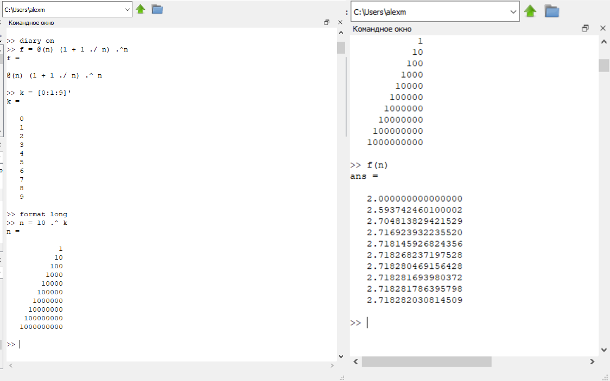
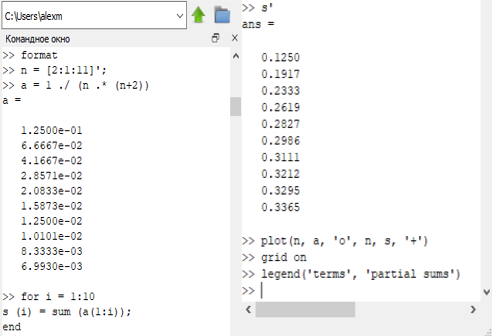
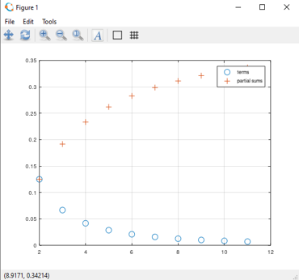
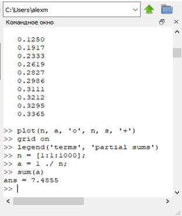
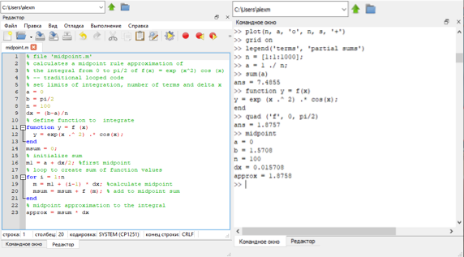
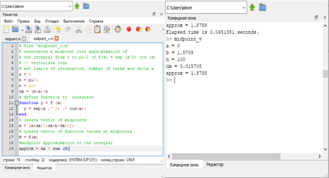
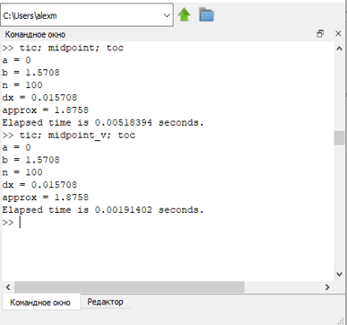

---
## Front matter
lang: ru-RU
title: Пределы, последовательности и ряды
author: Милёхин Александр НПМмд-02-21

## Formatting
mainfont: PT Serif
romanfont: PT Serif
sansfont: PT Sans
monofont: PT Mono
toc: false
slide_level: 2
theme: metropolis
header-includes: 
 - \metroset{progressbar=frametitle,sectionpage=progressbar,numbering=fraction}
 - '\makeatletter'
 - '\beamer@ignorenonframefalse'
 - '\makeatother'
aspectratio: 43
section-titles: true
---

## Цель работы

Научиться работать в Octave с пределами, последовательностями и рядами, а также научиться писать векторизованный программный код.  

## Пределы. Оценка

Определяем с помощью анонимной функции простую функцию. Создаём индексную переменную, возьмём степени 10, и оценим нашу функцию.

{ #fig:001 width=70% }

## Частичные суммы

Определим индексный вектор, а затем вычислим члены. После чего введем последовательность частичных сумм, используя цикл.

{ #fig:002 width=70% }

## Частичные суммы

Построенные слагаемые и частичные суммы представлены ниже ниже.  

{ #fig:003 width=70% }

## Сумма ряда

Найдём сумму первых 1000 членов гармонического ряда 1/n.  

{ #fig:004 width=70% }

## Вычисление интегралов

Численно посчитаем интеграл.  

{ #fig:005 width=70% }

## Аппроксимирование суммами

Напишем скрипт для того, чтобы вычислить интеграл по правилу средней точки. Введём код в текстовый файл и назовём его midpoint.m. Запустим этот файл в командной строке.

{ #fig:006 width=70% }

## Аппроксимирование суммами

Теперь напишем векторизованный код, не требующий циклов. Для этого создадим вектор х-координат средних точек. Запустим этот файл в командной строке.

{ #fig:007 width=70% }

## Аппроксимирование суммами

Запустим оба кода.

{ #fig:008 width=70% }

## Результат лабораторной работы

Я научился работать в Octave с пределами, последовательностями и рядами, а также научился писать векторизованный программный код. Я определил, что векторизованный код работает существенно быстрее, чем код с циклами.

## 

Спасибо за внимание