---
# Front matter
lang: ru-RU
title: "Лабораторная работа 7"
subtitle: "Отчет по лабораторной работе 7"
author: "Милёхин Александр НПМмд-02-21"

# Formatting
toc-title: "Содержание"
toc: true # Table of contents
toc_depth: 2
lof: true # List of figures
fontsize: 12pt
linestretch: 1.5
papersize: a4paper
documentclass: scrreprt
polyglossia-lang: russian
polyglossia-otherlangs: english
mainfont: PT Serif
romanfont: PT Serif
sansfont: PT Sans
monofont: PT Mono
mainfontoptions: Ligatures=TeX
romanfontoptions: Ligatures=TeX
sansfontoptions: Ligatures=TeX,Scale=MatchLowercase
monofontoptions: Scale=MatchLowercase
indent: true
pdf-engine: lualatex
header-includes:
  - \linepenalty=10 # the penalty added to the badness of each line within a paragraph (no associated penalty node) Increasing the value makes tex try to have fewer lines in the paragraph.
  - \interlinepenalty=0 # value of the penalty (node) added after each line of a paragraph.
  - \hyphenpenalty=50 # the penalty for line breaking at an automatically inserted hyphen
  - \exhyphenpenalty=50 # the penalty for line breaking at an explicit hyphen
  - \binoppenalty=700 # the penalty for breaking a line at a binary operator
  - \relpenalty=500 # the penalty for breaking a line at a relation
  - \clubpenalty=150 # extra penalty for breaking after first line of a paragraph
  - \widowpenalty=150 # extra penalty for breaking before last line of a paragraph
  - \displaywidowpenalty=50 # extra penalty for breaking before last line before a display math
  - \brokenpenalty=100 # extra penalty for page breaking after a hyphenated line
  - \predisplaypenalty=10000 # penalty for breaking before a display
  - \postdisplaypenalty=0 # penalty for breaking after a display
  - \floatingpenalty = 20000 # penalty for splitting an insertion (can only be split footnote in standard LaTeX)
  - \raggedbottom # or \flushbottom
  - \usepackage{float} # keep figures where there are in the text
  - \floatplacement{figure}{H} # keep figures where there are in the text
---

# Цель работы

Научиться строить различные виды графиков: параметрические, неявных функций, в полярных координатах. Обучиться работе с комплексными числами, изображать их на координатной плоскости.  

# Теоретические сведения

Вся теоретическая часть по выполнению лабораторной работы была взята из инструкции по лабораторной работе №5 ("Лабораторная работа №7. Описание") на сайте:
https://esystem.rudn.ru/course/view.php?id=12766

# Задание

Выполните работу и задокументируйте процесс выполнения.

# Выполнение лабораторной работы

**1. Параметрические графики**

В самом начале работы включим журналирование. Построим график трёх периодов циклоиды радиуса 2. Для этого определим параметр как вектор в некотором диапазоне, затем вычислим x и y. Выполнение команд показано на Fig. 1.

{ #fig:001 width=70% }

Полученный график изображен на Fig. 2.  

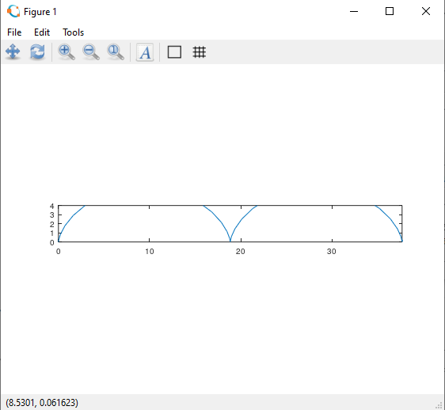{ #fig:002 width=70% }

**2. Полярные координаты**

Графики в полярных координатах строятся аналогичным образом. Построим улитку Паскаля. Ход работы показан на Fig. 3.  

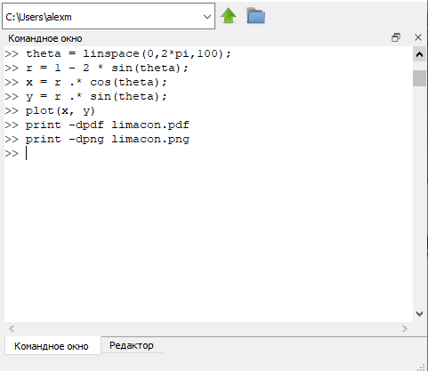{ #fig:003 width=70% }

Полученный график можно увидеть на Fig. 4.  

{ #fig:004 width=70% }

Более того, можно построить данный график в полярных осях. Команды показаны на Fig. 5.  

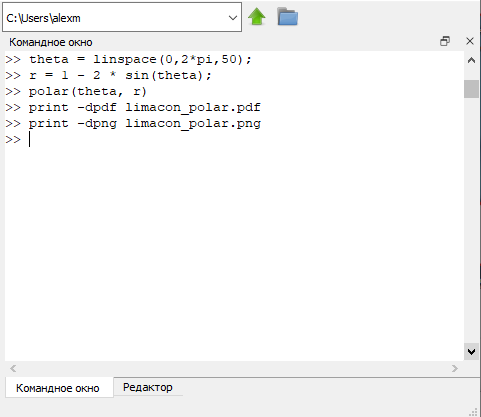{ #fig:005 width=70% }

А сам график показан на Fig. 6.

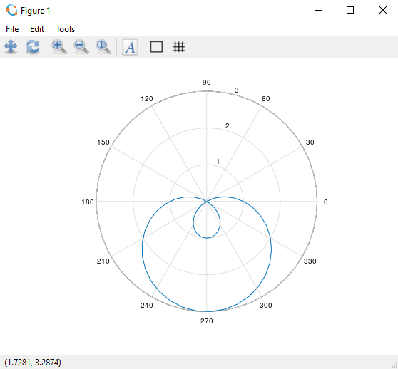{ #fig:006 width=70% }

**3. Графики неявных функций**

Следует построить неявно определённую функцию с помощью ezplot. Зададим график функции, используя лямбда-функцию, как показано на Fig. 7.  

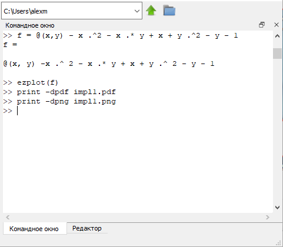{ #fig:007 width=70% }

После чего построим ее график. См. Fig. 8.  

{ #fig:008 width=70% }

Найдём уравнение касательной к некоторой окружности. Сначала построим круг, используя лямбда-функцию. Далее по правилу дифференцирования найдём уравнение касательной и изобразим  ее на графике. См. Fig. 9.  

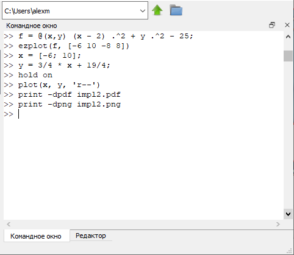{ #fig:009 width=70% }

Полученный график можно увидеть на Fig. 10.  

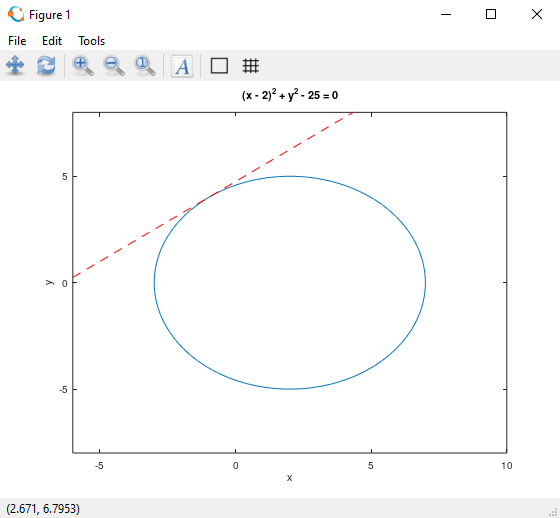{ #fig:010 width=70% }

**4. Комплексные числа**

Зададим два комплексных числа и запишем основные арифметические операции с ними: сложение, вычитание,  умножение, деление. См. Fig. 11.  

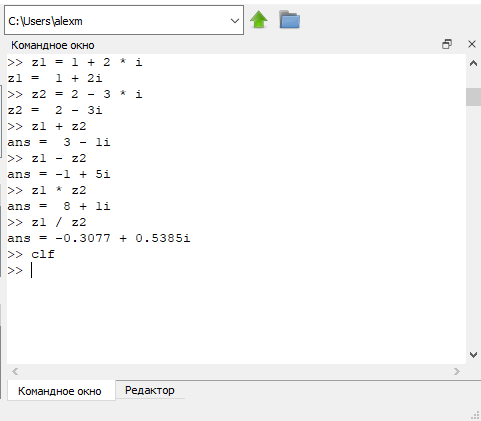{ #fig:011 width=70% }

Построим графики в комплексной плоскости, используя команду compass, используя команды, показанные на Fig. 12.  


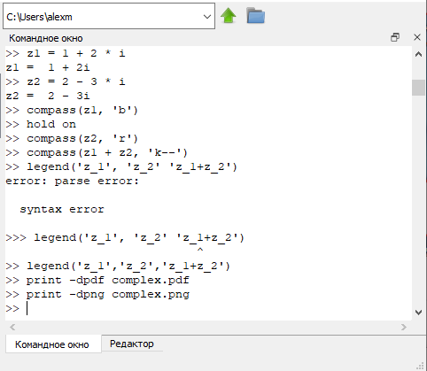{ #fig:012 width=70% }

Изображение графиков показано на Fig. 13.  

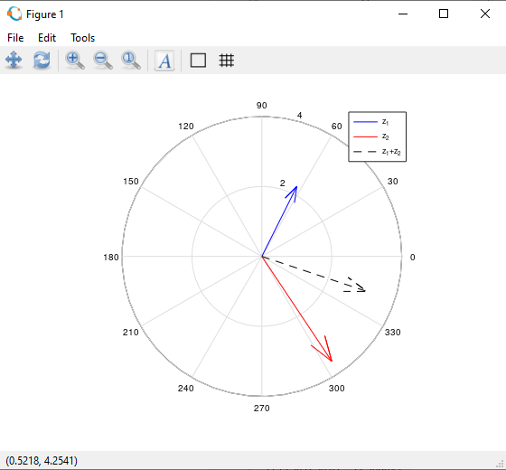{ #fig:013 width=70% }

Иногда мы можем получить странные результаты вывода программы. При вычислении корня третьей степени из -8, мы ожидаем ответ -2, но получаем другое число. Это объясняется тем, что Octave возвращает тот ответ, у которого меньший аргумент. Для того, чтобы получить -2, мы должны использовать команду nthroot, как показано на Fig. 14.  

{ #fig:014 width=70% }

**5. Специальные функции**

Построим гамма-функцию Г(х+1) и n! на одном графике, как показано на Fig. 15.  

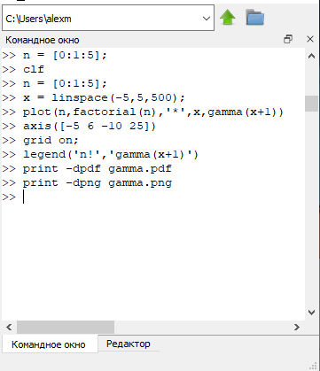{ #fig:015 width=70% }

Изображение показано на Fig. 16.  

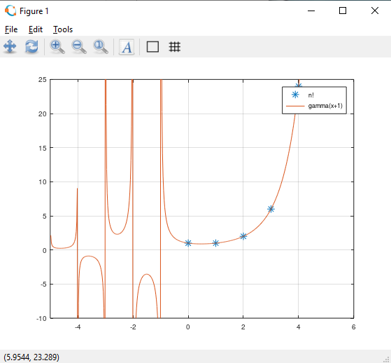{ #fig:016 width=70% }

Разделив область значения на отдельные интервалы, можно убрать артефакты вычислений. Для этого следует выполнить команды, указанные на Fig. 17.  

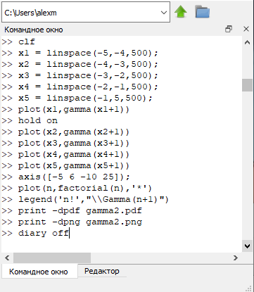{ #fig:017 width=70% }

После проведения вышеуказанных действий, построим график. См. Fig. 18  

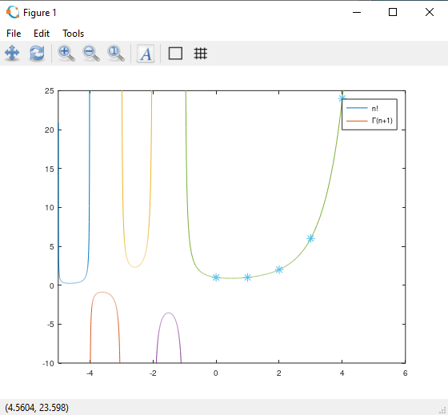{ #fig:018 width=70% }

# Выводы

Я научился строить в Octave различные виды графиков: параметрические, неявных функций, в полярных координатах. Также поработал с комплексными числами, научился изображать их на координатной плоскости; построил гамма-функцию и график факториала. 