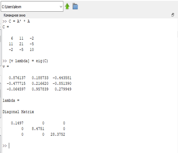
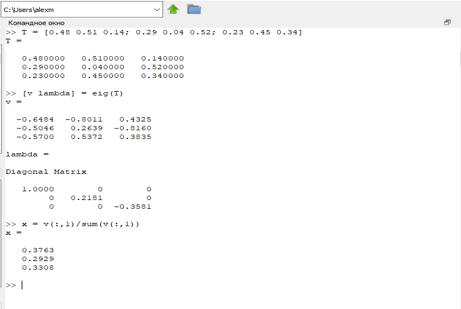
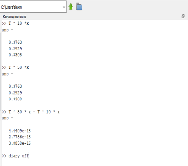

---
## Front matter
lang: ru-RU
title: Задача на собственные значения
author: Милёхин Александр НПМмд-02-21

## Formatting
mainfont: PT Serif
romanfont: PT Serif
sansfont: PT Sans
monofont: PT Mono
toc: false
slide_level: 2
theme: metropolis
header-includes: 
 - \metroset{progressbar=frametitle,sectionpage=progressbar,numbering=fraction}
 - '\makeatletter'
 - '\beamer@ignorenonframefalse'
 - '\makeatother'
aspectratio: 43
section-titles: true
---

## Цель работы

Научиться находить в Octave собственные значения и собственные векторы матрицы, а также научиться предсказывать вероятность состояния системы.

## Собственные значения и собственные векторы

Включим журналирование работы. После чего зададим матрицу А. Для нахождения собственных значений и собственных векторов матрицы используем команду eig с двумя выходными аргументами.

{ #fig:001 width=35% }

## Собственные значения и собственные векторы

Для того, чтобы получить матрицу с действительными собственными значениями, создадим симмитричную матрицу путём умножения исходной матрицы на транспонированную. И повторим шаги, проделанные ранее.

{ #fig:002 width=25% }

## Случайное блуждание

На курсе "Теория случайных процессов" мы дополнительно ознакомились с цепями Маркова. Наша задача - предсказать вероятности состояния системы. Для примера случайного блуждания найдем вектор вероятности после 5 шагов для каждого начального вектора.

## Случайное блуждание

Покажем, как мы задаем матрицу, начальные векторы, а затем находим соответствующие вероятности.

{ #fig:003 width=30% }

## Случайное блуждание

Теперь найдём вектор равновесного состояния для цепи Маркова с переходной матрицей.

{ #fig:004 width=35% }

## Случайное блуждание

Таким образом, x = (0.37631  0.29287  0.33082), является вектором равновесного состояния. Проверим это.

{ #fig:005 width=15% }

## Результат лабораторной работы

Я научился в Octave находить собственные значения и собственные векторы матрицы. Также научился работать с цепями Маркова и находить вектор равтовесия.

## 

Спасибо за внимание